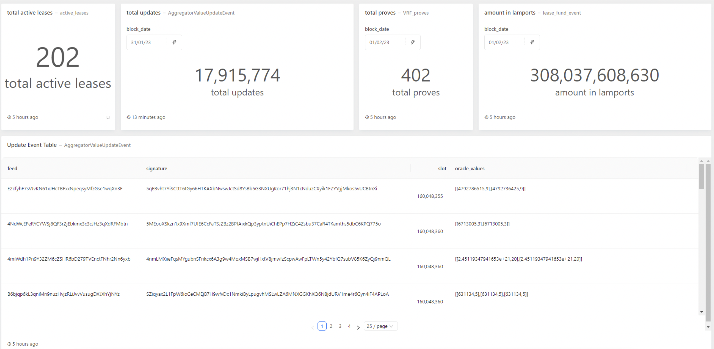

# Integrate Topledger dashboards

### Introduction

`tl-dashboards` is a <mark style="color:blue;">npm</mark> package for integrating customized dashboards on front-end.

### Required Libraries

* react (`>=16.8.0`)
* react-dom (`>=16.8.0`)

### Using npm&#x20;

```
npm install tl-dashboards
```

### Using yarn&#x20;

```
yarn add tl-dashboards
```

### Add a few dependencies

```
yarn add @ant-design/icons
```

```
yarn add d3 d3-cloud
```

### Copy required fonts to `public/fonts` directory

1. fontawesome-webfont.woff2: [https://cdnjs.cloudflare.com/ajax/libs/font-awesome/4.7.0/fonts/fontawesome-webfont.woff2](https://cdnjs.cloudflare.com/ajax/libs/font-awesome/4.7.0/fonts/fontawesome-webfont.woff2)
2. Material-Design-Iconic-Font.woff2: [https://cdnjs.cloudflare.com/ajax/libs/material-design-iconic-font/2.2.0/fonts/Material-Design-Iconic-Font.woff2](https://cdnjs.cloudflare.com/ajax/libs/material-design-iconic-font/2.2.0/fonts/Material-Design-Iconic-Font.woff2)

The public font directory should look like this:

```
public
└── fonts
    ├── fontawesome-webfont.woff2
    └── Material-Design-Iconic-Font.woff2
```

### Usage

You can use render the dashboard component anywhere inside react dom.

You can follow the basic example given below:

```javascript
import TLDashboards from "tl-dashboards";

function App() {
  return (
    <div className="App">
      <TLDashboards
        client="switchboard"
        token="puWU5mljkjOTxHLoaaVM7rFpxhrm7lQw3SkphtLV"
      />
    </div>
  );
}

export default App;
```


### Dashboard Output

<figure><figcaption></figcaption></figure>

### Important classes

Below classes refer to different elements in dashboard component. You can add style to change the background, border, etc.

1. **`.public-dashboard-page`** Refers to the main component container div.
2. **`.widget-visualization`** Refers to the widget component container div. You can add style to change the background, border, etc.
3. **`.query-link > .visualization-name`** Refers to the name of widget in bold.
4. **`.query-link > :nth-child(2)`** Refers to sub-text for widget name.
